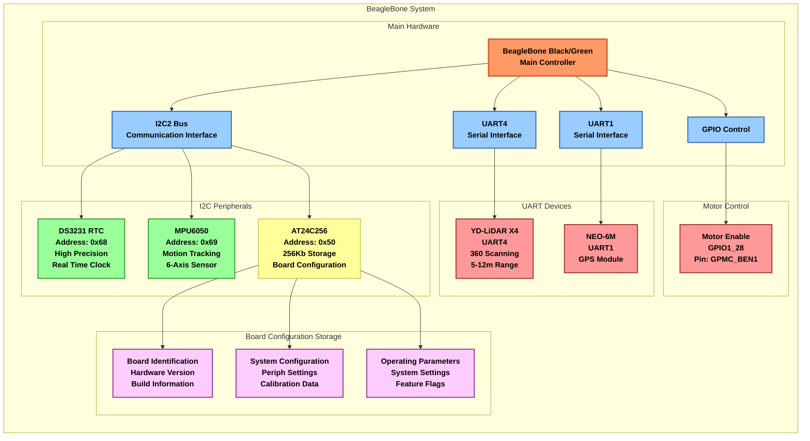

# Hardware Architecture

## Hardware Details

### Main Controller
- **BeagleBone Black/Green**
  - ARM Cortex-A8 processor
  - Multiple I2C, SPI, and UART interfaces
  - PRU real-time units
  - Supports multiple board variants

### Communication Interfaces

#### 1. I2C2 Bus
- Multiple I2C devices
- Standard mode operation
- Shared bus with multiple peripherals

#### 2. UART4
- LIDAR scanner interface
- Serial communication
- Distance measurement data

#### 3. UART1
- GPS module interface
- Serial communication
- Positioning data

#### 4. GPIO Control
- Motor enable pin (GPIO1_28/GPMC_BEN1)
- Output mode with pull-down
- Motor activation control

### I2C Peripherals

#### 1. DS3231 RTC Module
- **I2C Address**: 0x68
- **Features**:
  - High-precision real-time clock
  - Temperature-compensated crystal oscillator
  - ±2ppm accuracy
  - Battery backup
  - Temperature sensor

#### 2. MPU6050 Motion Sensor
- **I2C Address**: 0x69
- **Features**:
  - 6-axis motion tracking
  - 3-axis accelerometer
  - 3-axis gyroscope
  - Digital Motion Processor

#### 3. AT24C256 EEPROM
- **I2C Address**: 0x50
- **Specifications**:
  - 256Kb (32KB) storage capacity
  - Write protect support
  - 1 million write cycles
  - 100 years data retention
- **Usage**:
  - Board variant identification
  - System configuration storage
  - Calibration data
  - Feature flags

### Motor Control System
- **Enable Pin**: GPIO1_28 (GPMC_BEN1)
- **Configuration**:
  - Output mode
  - Pull-down enabled
  - Default state: off
- **Features**:
  - Motor activation control
  - Software-controlled enable/disable
  - Status monitoring

### LIDAR System
- **Interface**: UART4
- **Features**:
  - Distance measurement
  - Scanning capability
  - Real-time data acquisition
- **Integration**:
  - Connected via serial interface
  - Motor control for scanning
  - Data processing through main processor

### GPS Module
- **Interface**: UART1
- **Features**:
  - Standard NMEA data output
  - Serial communication
  - Built-in antenna
  - Power-saving modes
